# Pitter, Patter, Platters
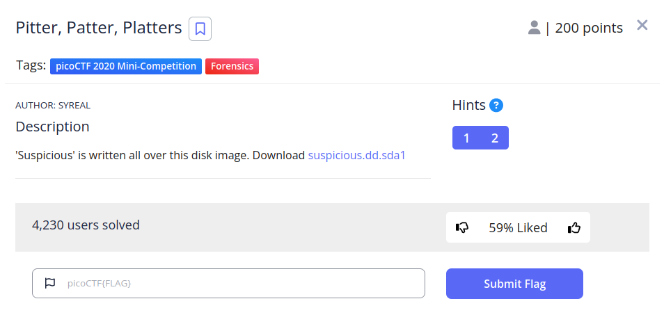

## Descripción
'Suspicious' is written all over this disk image. Download [suspicious.dd.sda1](https://jupiter.challenges.picoctf.org/static/0d39390cff1ab51699596b6e650e7cba/suspicious.dd.sda1)

## Resolucion
Nos proporcionan un archivo de imagen de disco, si intentamos obtener el tipo de particiones con `mmls suspicious.dd.sda1` no obtendremos ningún resultado.

Intenamos mirar sus archivos con `fls -r -p suspicious.dd.sda1`:

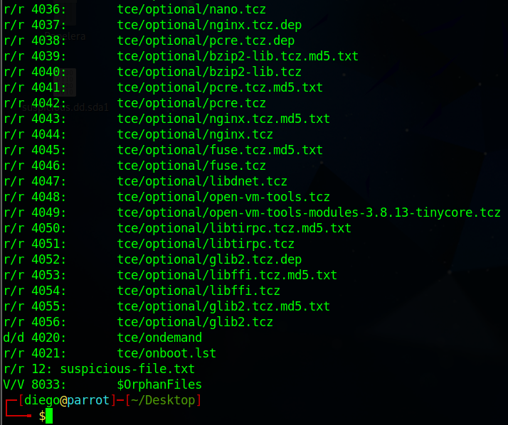

Encontramos un archivo llamado 'suspicious-file.txt'. Como tenenmos su inodo (12), podemos ver su contenido con icat:

```
icat suspicious.dd.sda1 12
```

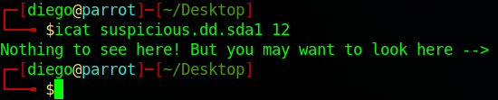

Parece que no podremos acceder a la información por icat, pero está cerca del archivo, usaremos autopsy entonces.

1. Tendremos que anotar el sistema de archivos de la imagen (en este caso ext3):

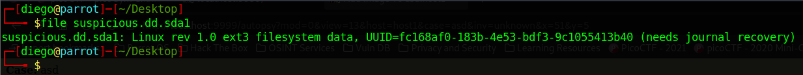

2. Ejecutamos autopsy:

```
sudo autopsy
```

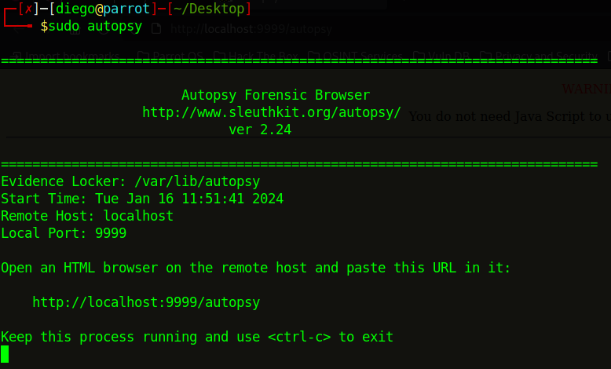

3. Abrimos el navegador y entramos en la url que nos ha dado el programa.

4. Creamos un nuevo caso con el nombre que queramos.
5. Añadimos el host con las opciones que nos da el programa por defecto.
6. Ponemos la ruta de la imágen y seleciconamos 'Partition':

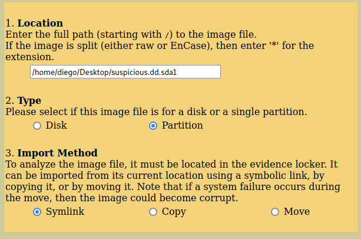

7. Nos aseguramos de el hash se calcule y de que el sistema de archivos sea 'ext':

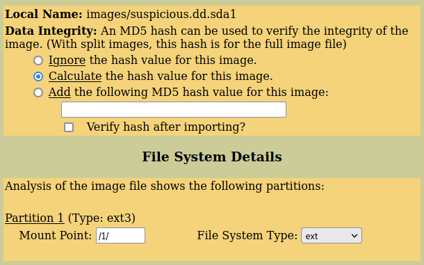

8. Analizamos y entramos en "File Analysis"

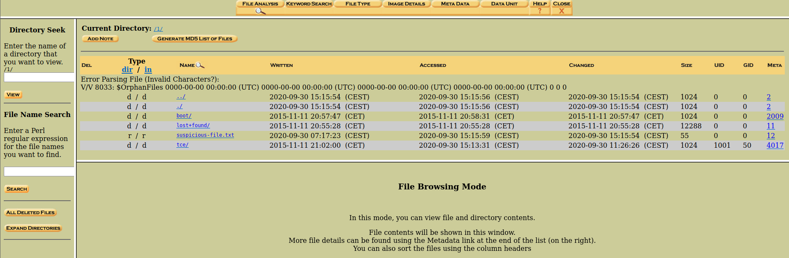

9. Entramos en el inodo 12

10. Entramos en el bloque directo 2049:

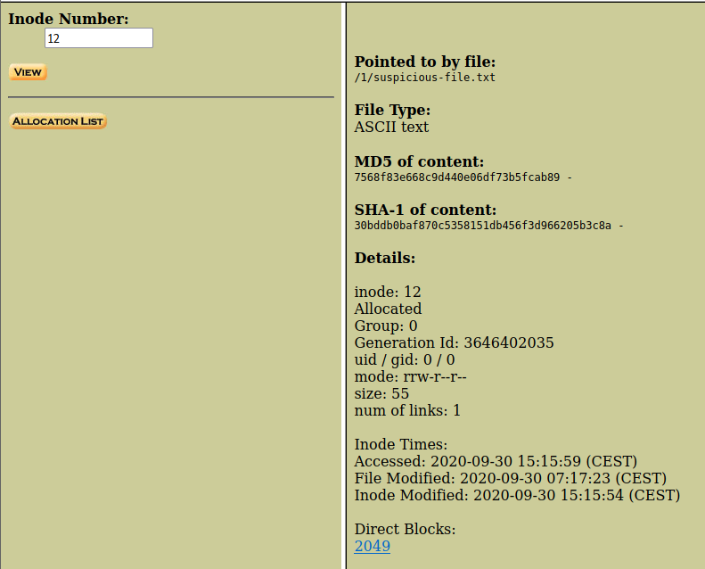

11. Nos dan el siguiente resultaod que parece una flag al revés:

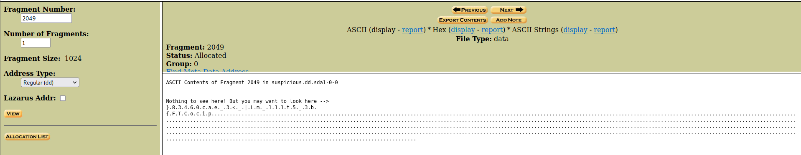

*Si la visualización (display) está en Strings no se verña la flag, debe estar en ASCII normal o en HEX, es por esto que no lo podíamos ver antes.

Con python podemos darle a la flag el formato necesario:

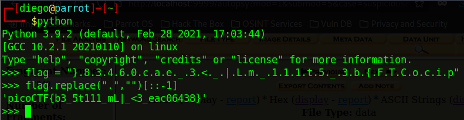

Obteniendo así la flag: 'picoCTF{b3_5t111_mL|_<3_eac06438}'