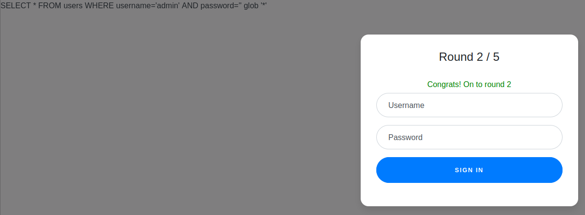

# Web Gauntlet


## Descripción
Can you beat the filters? Log in as admin [http://jupiter.challenges.picoctf.org:9683/](http://jupiter.challenges.picoctf.org:9683/) [http://jupiter.challenges.picoctf.org:9683/filter.php](http://jupiter.challenges.picoctf.org:9683/filter.php)

## Resolucion
Entramos en el primer enlace y nos encontramos con un formulatio de login:


En el segundo enlace se nos dice que se filtrará 'or':


Usamos la siguiente combinación de usuario y contraseña:

- Usuario: admin
- Contraseña: ' glob '*
- - ' nos permite cerrar la query de SQLite
- - glob se usa para buscar cualquier coincidencia según la expresión regular proporcionada
- - ' cerrará con el ' de la query
- - \* indica que se acewpte cualquier coincidencia.

Crearemos así la query:

```
SELECT username, password FROM users WHERE username='admin' AND password='' glob '*' 
```

Consiguiendo que ambos lados del AND den ressultado y permitiéndonos avanzar.

Hecho esto entramos en la ronda 2:



Si actualizamos la página de filtros veremos que han cambiado:


La misma combinación de usuario y contraseña nos servirá para esta ronda.

Los filtros vuelven a cambiar en la ronda 3:


Aunque no venga en los filtros, esta vez los espacios estarán filtrados, tendremos que cambiar ligeramente la contraseña:
- Usuario: admin
- Contraseña: 'glob'*

En la ronda 4 los filtros vuelven a cambiar:


Esta vez tendremos que usar la siguiente combinación:

- Usuario: ad'||'min
- Contraseña: 'glob'*

Para así concatenar admin tras pasar el filtro de php en la consulta de SQLite.

En la ronda 5 los filtros son:


Así que la combinación anterior volvera a funcionar.


Y en 'filter.php' aparecerá la flag:


Obteniendo así: 'picoCTF{y0u_m4d3_1t_d846125f7bdbf4d6e89cbc5edb6fa739}'.